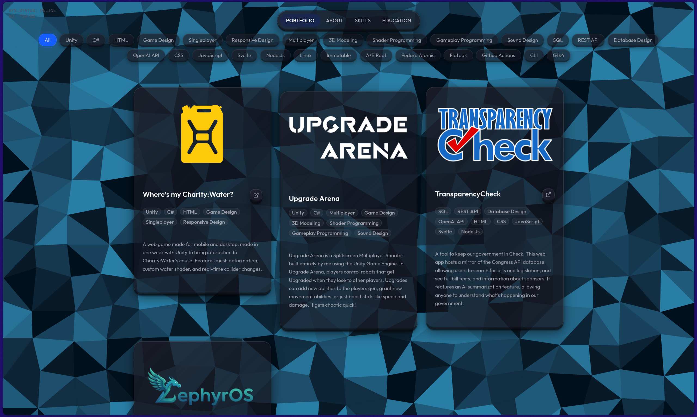
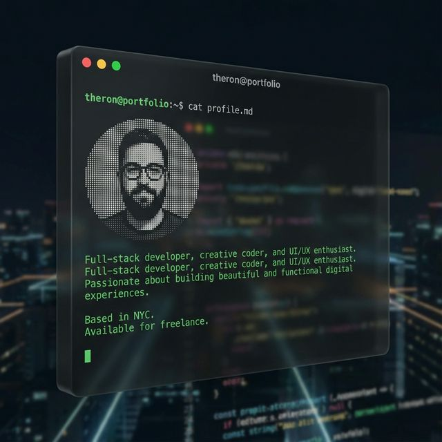
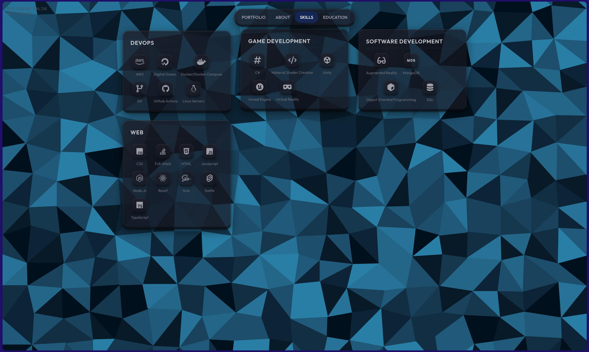

# ⚡ React Portfolio

A modern, dynamic portfolio website built with **Next.js 16**, featuring a premium **liquid glass** UI with 3D depth effects, interactive tilt animations, and a full admin CMS.



---

## ✨ Features

### 🎨 Design
- **Liquid Glassmorphism** — Frosted glass panels with 3D slab thickness, layered shadows, and inner glow highlights
- **Interactive 3D Tilt** — Cards respond to mouse movement with smooth spring-physics tilting
- **Floating Animations** — Organic bobbing motion on interactive elements
- **Animated Page Transitions** — Blur/scale transitions between sections via Framer Motion
- **Responsive Design** — Optimized for mobile, tablet, and desktop
- **Custom Background** — Full-viewport background image with dark glass overlay

### 📂 Sections
| Section | Description |
|---------|-------------|
| **Portfolio** | Filterable project grid with tag-based filtering, logo mode toggle, and external links |
| **About** | Terminal-themed profile viewer with profile image, bio, and social links |
| **Skills** | Categorized skill grid with icon support (Font Awesome + emoji) |
| **Education** | Timeline-style display split into formal education and certifications |

### 🔧 Admin Panel
- Full CRUD management for all sections
- Image uploads via **UploadThing**
- Logo mode toggle for portfolio images
- Tag management for portfolio filtering
- Social link management with icon picker

---

## 🖼️ Screenshots

### Portfolio Section
Filterable project cards with liquid glass styling and 3D depth.


### About Section — Terminal Theme
Interactive terminal window with profile photo, bio text, and social links.



### Skills Section
Categorized skill panels with icon tiles in frosted glass cards.



---

## 🛠️ Tech Stack

| Category | Technology |
|----------|-----------|
| **Framework** | Next.js 16 (App Router) |
| **Frontend** | React 19, Framer Motion |
| **Styling** | Tailwind CSS 4, Custom Glassmorphism CSS |
| **Typography** | Google Fonts (Outfit, Geist Mono) |
| **Icons** | Font Awesome (NPM), Lucide React |
| **Database** | MongoDB via Mongoose |
| **File Upload** | UploadThing |
| **UI Components** | shadcn/ui (Radix UI primitives) |

---

## 🚀 Getting Started

### Prerequisites
- Node.js 18+
- MongoDB instance (local or Atlas)
- UploadThing account & token

### Installation

```bash
# Clone the repository
git clone https://github.com/yourusername/reactportfolio.git
cd reactportfolio

# Install dependencies
npm install
```

### Environment Variables

Create a `.env.local` file in the root directory:

```env
MONGODB_URI=mongodb+srv://your-connection-string
UPLOADTHING_TOKEN=your-uploadthing-token
ADMIN_PASSWORD=your-admin-password
```

### Development

```bash
npm run dev
```

Open [http://localhost:3000](http://localhost:3000) for the portfolio and [http://localhost:3000/admin](http://localhost:3000/admin) for the admin panel.

### Production Build

```bash
npm run build
npm start
```

---

## 📁 Project Structure

```
reactportfolio/
├── app/
│   ├── admin/              # Admin dashboard & editors
│   │   ├── components/     # Editor components (Portfolio, Skills, Education, Profile)
│   │   └── page.jsx        # Admin page with tabbed interface
│   ├── api/                # REST API routes
│   │   ├── portfolio/      # Portfolio CRUD
│   │   ├── education/      # Education CRUD
│   │   ├── skills/         # Skills CRUD
│   │   ├── profile/        # Profile CRUD
│   │   └── uploadthing/    # File upload endpoint
│   ├── globals.css         # Global styles + glass utilities
│   ├── layout.js           # Root layout with fonts
│   └── page.js             # Main portfolio page
├── components/
│   ├── ui/                 # shadcn UI primitives
│   ├── IconRenderer.jsx    # Dynamic Font Awesome icon renderer
│   ├── LiquidNavbar.jsx    # Animated navigation bar
│   ├── SectionAbout.jsx    # Terminal-themed about page
│   ├── SectionEducation.jsx
│   ├── SectionPortfolio.jsx
│   ├── SectionSkills.jsx
│   └── TiltCard.jsx        # 3D tilt + float animation wrapper
├── lib/
│   ├── db.js               # MongoDB connection
│   ├── fontawesome.js      # Font Awesome library config
│   └── utils.js            # Utility functions
├── models/
│   └── index.js            # Mongoose schemas
└── docs/
    └── screenshots/        # README screenshots
```

---

## 🌐 Deployment

This is a full-stack Next.js app and requires a Node.js runtime.

---

## 📄 License

This project is open source and available under the [MIT License](LICENSE).
